<h1>UMANG SHAH (uks8451)</h1>

# Part 1.1: DATAPROC USAGE

## Create directory uks8451-bd23 
- Command: 
    ```bash
    hadoop fs -mkdir uks8451-bd23
    ```
- Screenshot:
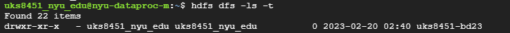

- Extract Input files in hw1.2 directory
- Commands:
    ```bash
        unzip hw1.2.zip
        hadoop dfs -mkdir hw1.2
        hadoop dfs -put hw1.2
        hadoop dfs -ls hw1.2
    ```
- Screenshots:
    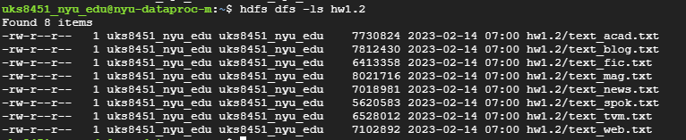

# Part 1.2: N_GRAM CONDITIONAL PROBABILITY 

### TLDR: ```bash commands.sh```

    
## Job 1: Unigram Frequencies
- Input: text data
- Mapper: ```python n_gram_count_mapper.py n, min_words```<br>
    n => 1 for unigram<br>
    min_words=> 3 (Minimum words a line should have to be considered valid)<br>
    Outputs: ```<uni_gram><tab>1``` 

- Reducer: ```python n_gram_count_reducer.py```
- Outputs: ```<uni_gram><tab><count>```
- Command:
    ```bash
    hadoop fs -rm -r 1_grams ; 
    mapred streaming -file n_gram_count_mapper.py \
    -file n_gram_count_reducer.py \
    -input hw1.2/* \
    -output 1_grams \
    -mapper "python n_gram_count_mapper.py 1 3" \
    -reducer "python n_gram_count_reducer.py
    ```
- Screenshot<br/>
    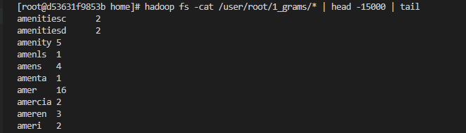<br/>

## Job 2: Unigram Total Count
- Input: Unigram Frequencies
- Mapper: ```cat ```
- Combiner: ```python n_gram_sum_reducer```
- Reducer: ```python n_gram_sum_reducer```
- Outputs: ```sum<tab><total_count>```
- Command:
    ```bash
    hadoop fs -rm -r 1_grams_sum; \
    mapred streaming -file n_gram_count_mapper.py \
    -file n_gram_sum_reducer.py \
    -input 1_grams/* \
    -output 1_grams_sum \
    -mapper "cat" \
    -combiner "python n_gram_sum_reducer.py" \
    -reducer "python n_gram_sum_reducer.py"
    ```
- Screenshot<br/>
    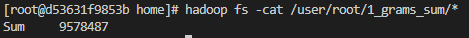<br/>

## Job 3: Unigram Probability
- Input: Unigram Frequencies
- Mapper: ```uni_gram_prob_mapper.py <unigram_total_sum> ```

    unigram_total_sum = $(hadoop fs -cat 1_grams_sum\/*  | cut -f 2)
- Reducer: ```cat```
- Outputs: ```<uni_gram><tab><uni_gram_prob>```
- Command:
    ```bash
    hadoop fs -rm -r 1_grams_prob; \
    mapred streaming -file uni_gram_prob_mapper.py \
    -input 1_grams/* \
    -output 1_grams_prob \
    -mapper "python uni_gram_prob_mapper.py $(hadoop fs -cat 1_grams_sum\/*  | cut -f 2)" \
    -reducer "cat"
    ```
- Screenshot<br/>
    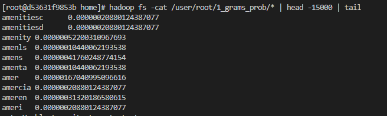<br/>

## Job 4: Bigram Frequencies
- Input: text data
- Mapper: ```python n_gram_count_mapper.py n, min_words```<br>
    n => 2 for bigram<br/>
    min_words=> 3 (Minimum words a line should have to be considered valid)<br>
    Outputs: ```<bi_gram><tab>1``` 

- Reducer: ```python n_gram_count_reducer.py```
- Outputs: ```<bi_gram><tab><count>```
- Command:
    ```bash
    hadoop fs -rm -r 2_grams ; \
    mapred streaming -file n_gram_count_mapper.py \
    -file n_gram_count_reducer.py \
    -input hw1.2/* \
    -output 2_grams \
    -mapper "python n_gram_count_mapper.py 2 3" \
    -reducer "python n_gram_count_reducer.py"
    ```
- Screenshot<br/>
    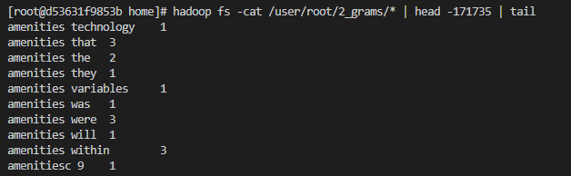<br/>

## Job 5: Bigram Total Count
- Input: Bigram Frequencies
- Mapper: ```cat ```
- Combiner: ```python n_gram_sum_reducer```
- Reducer: ```python n_gram_sum_reducer```
- Outputs: ```sum<tab><total_count>```
- Command:
    ```bash
    hadoop fs -rm -r 2_grams_sum; \
    mapred streaming -file n_gram_count_mapper.py \
    -file n_gram_sum_reducer.py \
    -input 2_grams/* \
    -output 2_grams_sum \
    -mapper "cat" \
    -combiner "python n_gram_sum_reducer.py" \
    -reducer "python n_gram_sum_reducer.py"
    ```
- Screenshot<br/>
    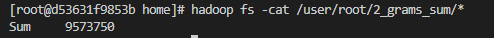<br/>

## (Final) Job 6: Bigram Conditional Probability


- Input: Unigram Probabilities, Bigram Frequencies
- Mapper: ```python n_gram_prob_mapper.py 2 <bigram_total_sum> ```<br/>
    bigram_total_sum = $(hadoop fs -cat 2_grams_sum\/*  | cut -f 2)<br/>
    Outputs:
        For every line from bi_gram_counts: ```<word_1><tab><word2><tab><bi_gram_frequency/bigram_total_sum>```<br/>
        For each line from unigram_probabilities
        ```<unigram><tab>-<unigram_probability>```
- Reducer: ```python n_gram_prob_reducer.py```

- Other command options:<br/>
    >
    - --partitioner "org.apache.hadoop.mapred.lib.KeyFieldBasedPartitioner"<br/>
    Specify that the key is made up of multiple fields
    - -D stream.num.map.output.key.fields=2<br/>
    Specify that the key contains two fields<br>
    - -D mapred.text.key.partitioner.options="-k1,1"<br/>
    Partition on the first field only to ensure all bigrams and their respective unigrams are provided to the same reducer<br/>
    - -D mapred.text.key.comparator.options="-k1,2"<br/>
    Sort Reducer input by second field ensuring all unigrams precede their respective bigrams in order<br>

- Outputs: ```<bi_gram><tab><bi_gram_conditional_prob>```


- Command:
    ```bash
    hadoop fs -rm -r 2_grams_prob; \
    mapred streaming \
    -D stream.num.map.output.key.fields=2 \
    -D mapred.text.key.partitioner.options="-k1,1" \
    -D mapred.text.key.comparator.options="-k1,2" \
    -file n_gram_prob_mapper.py \
    -file n_gram_prob_reducer.py \
    -input 2_grams/* \
    -input 1_grams_prob/* \
    -output 2_grams_prob \
    -mapper "python n_gram_prob_mapper.py 2 $(hadoop fs -cat 2_grams_sum\/*  | cut -f 2)" \
    -reducer "python n_gram_prob_reducer.py" \
    --partitioner "org.apache.hadoop.mapred.lib.KeyFieldBasedPartitioner"
    ```

- Screenshot<br/>
    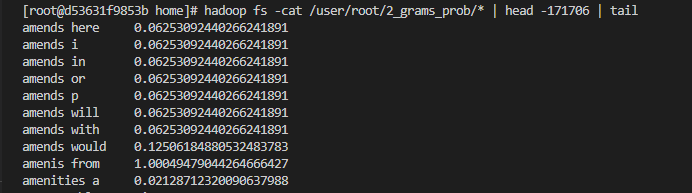<br/>
# Part 1.3 Bonus : Most Probable word after "United States"

## Job 1,2,3 Calculate Trigram Frequencies, Total and Probabilities
<br/>
Calculate Trigram Frequencies, Trigram Total Counts and Trigram Conditional Probability using the commands below. It uses the same files and approach as Bigram Frequencies, Bigram Totak Count and Bigram Conditional Probability<br/> 

- Input: text data
- Output: Trigram Frequencies
- Commands: 
    ```bash
    # Trigram Frequencies
    hadoop fs -rm -r 3_grams ; \
    mapred streaming -file n_gram_count_mapper.py \
    -file n_gram_count_reducer.py \
    -input hw1.2/* \
    -output 3_grams \
    -mapper "python n_gram_count_mapper.py 3 3" \
    -reducer "python n_gram_count_reducer.py";

    # Trigram Total Count
    hadoop fs -rm -r 3_grams_sum; \
    mapred streaming -file n_gram_count_mapper.py \
    -file n_gram_sum_reducer.py \
    -input 3_grams/* \
    -output 3_grams_sum \
    -mapper "cat" \
    -numReduceTasks 1 \
    -reducer "python n_gram_sum_reducer.py " ;

    # Trigram Conditional Probabilities
    hadoop fs -rm -r 3_grams_prob; \
    mapred streaming \
    -D stream.num.map.output.key.fields=2 \
    -D mapred.text.key.partitioner.options="-k1,1" \
    -D mapred.text.key.comparator.options="-k1,2" \
    -file n_gram_prob_mapper.py \
    -file n_gram_prob_reducer.py \
    -input 3_grams/* \
    -input 2_grams_prob/* \
    -output 3_grams_prob \
    -mapper "python n_gram_prob_mapper.py 3 $(hadoop fs -cat 3_grams_sum\/*  | cut -f 2)" \
    -reducer "python n_gram_prob_reducer.py" \
    --partitioner "org.apache.hadoop.mapred.lib.KeyFieldBasedPartitioner";
    ```

- Screenshot<br/>
    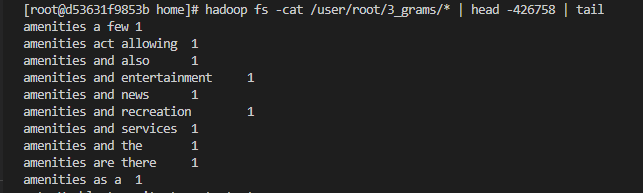<br/>

    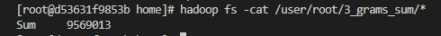<br/>

    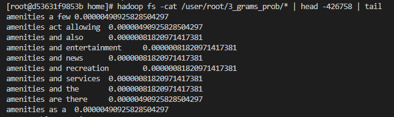<br/>

## Job 4: 
<br/>
Sort the Trigram conditional probabilities by probability value.

- Input: Trigram Conditional Probabilities
- Output: Trigrams sorted by Conditional Probabilities
- Mapper: ```python n_gram_sort_mapper.py```
    Outputs: ```<word1><space><word2><tab><probability><tab><word3>```
- Reducer: ```cat```
- Output:
        ``` 
            <word1><space><word2><tab><probability><tab><word3>
        ```Sorted in ascending  based on probability
- Other command options:<br/>
    >
    - --partitioner "org.apache.hadoop.mapred.lib.KeyFieldBasedPartitioner"<br/>
    Specify that the key is made up of multiple fields
    - -D stream.num.map.output.key.fields=2<br/>
    Specify that the key contains two fields<br>
    - -D mapred.text.key.partitioner.options="-k1,1"<br/>
    Partition on the first field only to ensure all bigrams and their respective unigrams are provided to the same reducer<br/>
    - -D mapred.text.key.comparator.options="-k1,2"<br/>
    Sort Reducer input by second field ensuring all unigrams precede their respective bigrams in order<br>
- Command:
    ```bash
    hadoop fs -rm -r 3_grams_sorted; mapred streaming \
    -D stream.num.map.output.key.fields=3 \
    -D mapred.text.key.partitioner.options="-k1,1" \
    -D mapred.text.key.comparator.options="-k1,2" \
    -file n_gram_sort_mapper.py \
    -input 3_grams_prob/* \
    -mapper "python n_gram_sort_mapper.py" \
    -output 3_grams_sorted \
    -reducer "cat" \
    --partitioner "org.apache.hadoop.mapred.lib.KeyFieldBasedPartitioner"
    ```

- Screeshot<br/>
    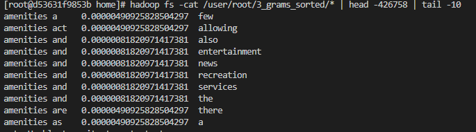

## Final Output
- Command:<br/>
    ```bash
    hadoop fs -cat 3_grams_sorted/* | grep -P "^united states\t" | tail -n 1;
    ```
- Screenshot:<br/>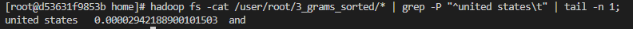


